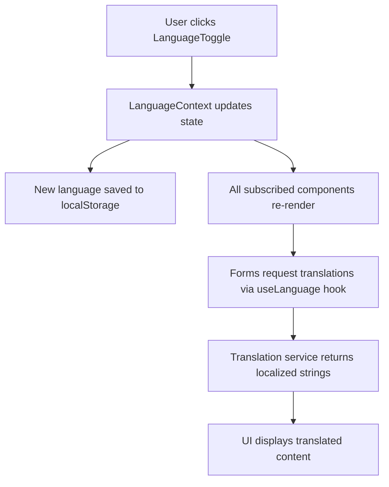

# Design Document: Amharic Registration Fields

## Overview

This design document specifies the implementation of bilingual (English/Amharic) support for registration forms in the Hitsanat KFL church management system. The solution follows the existing ThemeContext pattern to provide a centralized language management system that enables users to switch between English and Amharic languages across the Member Registration and Children Registration forms.

### Goals

- Enable bilingual support for all registration form fields, labels, placeholders, and messages
- Provide a seamless language switching experience without page reloads
- Persist language preferences across sessions using local storage
- Maintain consistency with existing application patterns (ThemeContext, Layout structure)
- Ensure accessibility compliance for screen readers and keyboard navigation

### Non-Goals

- Translation of non-registration pages (dashboards, reports, etc.)
- Right-to-left (RTL) layout support (Amharic uses left-to-right script)
- Dynamic translation loading from external services
- User-editable translations or translation management UI

## Architecture

### System Components

The language management system consists of four primary components:

1. **LanguageContext**: React context provider managing global language state
2. **LanguageToggle**: UI component for switching languages in the application header
3. **Translation Service**: Structured translation data and retrieval functions
4. **Form Components**: Updated registration forms consuming language context

### Data Flow



### Context Architecture

Following the existing ThemeContext pattern:

```typescript
LanguageProvider (wraps App)
  ├─ Language state management
  ├─ localStorage persistence
  ├─ Translation retrieval function
  └─ Language toggle function
```

## Components and Interfaces

### 1. LanguageContext

**Location**: `src/app/context/LanguageContext.tsx`

**Purpose**: Centralized language state management following the ThemeContext pattern

**Interface**:

```typescript
export type Language = 'en' | 'am';

export interface LanguageContextValue {
  language: Language;
  toggleLanguage: () => void;
  t: (key: string) => string;
}

export const LanguageContext = createContext<LanguageContextValue | null>(null);

export function LanguageProvider({ children }: { children: ReactNode }): JSX.Element;

export function useLanguage(): LanguageContextValue;
```

**Key Functions**:

- `getInitialLanguage()`: Retrieves language from localStorage or defaults to 'en'
- `applyLanguage(language)`: Saves language preference to localStorage
- `toggleLanguage()`: Switches between 'en' and 'am'
- `t(key)`: Translation function that retrieves localized string for a given key

**Implementation Pattern** (mirrors ThemeContext):

```typescript
function getInitialLanguage(): Language {
  try {
    const stored = localStorage.getItem('language');
    if (stored === 'en' || stored === 'am') return stored;
  } catch { /* ignore */ }
  return 'en';
}

function applyLanguage(language: Language) {
  try {
    localStorage.setItem('language', language);
  } catch { /* ignore */ }
}
```

### 2. LanguageToggle Component

**Location**: `src/app/components/LanguageToggle.tsx`

**Purpose**: UI control for switching languages, displayed in application header

**Interface**:

```typescript
export function LanguageToggle(): JSX.Element;
```

**Visual Design**:

- Button with ghost variant (matches ThemeToggle style)
- Displays current language code: "EN" or "አማ" (Amharic abbreviation)
- Icon size: w-5 h-5 (consistent with other header icons)
- Positioned in header between notifications and theme toggle

**Accessibility**:

- ARIA label: "Toggle language" / "ቋንቋ ቀይር"
- Keyboard accessible (standard button behavior)
- Screen reader announcement on language change

### 3. Translation Service

**Location**: `src/app/lib/translations.ts`

**Purpose**: Structured translation data and type-safe access

**Data Structure**:

```typescript
export interface Translations {
  common: {
    back: string;
    next: string;
    submit: string;
    male: string;
    female: string;
    // ... other common terms
  };
  memberRegistration: {
    title: string;
    steps: {
      personal: string;
      campus: string;
      contact: string;
      kehnet: string;
      photo: string;
    };
    sections: {
      personalInfo: string;
      campusEducation: string;
      contactInfo: string;
      kehnetRole: string;
      photoUpload: string;
    };
    fields: {
      givenName: { label: string; placeholder: string };
      fatherName: { label: string; placeholder: string };
      // ... all other fields
    };
    options: {
      campuses: { main: string; gendeje: string; station: string };
      years: string[];
      kehnetRoles: { deacon: string; kes: string; mergeta: string };
    };
    messages: {
      success: string;
      errorNameRequired: string;
      errorPhoneRequired: string;
      errorGenderRequired: string;
    };
  };
  childrenRegistration: {
    // Similar structure to memberRegistration
  };
  photoUpload: {
    dragDrop: string;
    clickBrowse: string;
    fileTypes: string;
    clickToChange: string;
  };
}

export const translations: Record<Language, Translations>;
```

**Translation Keys Organization**:

- **Hierarchical structure**: `category.subcategory.field`
- **Consistent naming**: camelCase for keys
- **Fallback behavior**: Returns key if translation not found

**Example Translations**:

```typescript
export const translations = {
  en: {
    common: {
      back: 'Back',
      next: 'Next',
      submit: 'Submit Registration',
      male: 'Male',
      female: 'Female',
    },
    memberRegistration: {
      title: 'Member Registration',
      fields: {
        givenName: {
          label: 'Given Name',
          placeholder: 'Given Name',
        },
        fatherName: {
          label: "Father's Name",
          placeholder: "Father's Name",
        },
      },
    },
  },
  am: {
    common: {
      back: 'ወደኋላ',
      next: 'ቀጣይ',
      submit: 'ምዝገባ አስገባ',
      male: 'ወንድ',
      female: 'ሴት',
    },
    memberRegistration: {
      title: 'የአባል ምዝገባ',
      fields: {
        givenName: {
          label: 'የተሰጠ ስም',
          placeholder: 'የተሰጠ ስም',
        },
        fatherName: {
          label: 'የአባት ስም',
          placeholder: 'የአባት ስም',
        },
      },
    },
  },
};
```

### 4. Updated Form Components

**Affected Files**:

- `src/app/pages/MemberRegistrationForm.tsx`
- `src/app/pages/ChildrenRegistrationForm.tsx`
- `src/app/components/StepWizard.tsx`
- `src/app/components/Layout.tsx`

**Integration Pattern**:

```typescript
// In form components
import { useLanguage } from '../context/LanguageContext';

export default function MemberRegistrationForm() {
  const { t } = useLanguage();
  
  // Use translation function for all text
  const STEPS = [
    { label: t('memberRegistration.steps.personal') },
    { label: t('memberRegistration.steps.campus') },
    // ...
  ];
  
  return (
    <StepWizard 
      steps={STEPS} 
      current={step} 
      title={t('memberRegistration.title')} 
    />
  );
}
```

## Data Models

### Language State

```typescript
type Language = 'en' | 'am';

interface LanguageState {
  current: Language;
  available: Language[];
}
```

### Translation Entry

```typescript
interface TranslationEntry {
  label?: string;
  placeholder?: string;
  value?: string;
}

type TranslationValue = string | TranslationEntry | Record<string, any>;
```

### Local Storage Schema

```typescript
// Key: 'language'
// Value: 'en' | 'am'
localStorage.setItem('language', 'en');
```

## Error Handling

### Translation Key Not Found

**Scenario**: Component requests translation for non-existent key

**Handling**:

```typescript
function t(key: string): string {
  const keys = key.split('.');
  let value: any = translations[language];
  
  for (const k of keys) {
    if (value && typeof value === 'object' && k in value) {
      value = value[k];
    } else {
      console.warn(`Translation key not found: ${key}`);
      return key; // Fallback to key itself
    }
  }
  
  return typeof value === 'string' ? value : key;
}
```

### Local Storage Unavailable

**Scenario**: Browser blocks localStorage access (private mode, security settings)

**Handling**:

```typescript
function getInitialLanguage(): Language {
  try {
    const stored = localStorage.getItem('language');
    if (stored === 'en' || stored === 'am') return stored;
  } catch (error) {
    console.warn('localStorage unavailable, using default language');
  }
  return 'en';
}
```

### Invalid Language Value

**Scenario**: localStorage contains invalid language value

**Handling**:

- Type guard validation: `if (stored === 'en' || stored === 'am')`
- Fallback to default 'en' if validation fails
- No error thrown, silent fallback

## Testing Strategy

### Unit Tests

**Test Coverage**:

1. **LanguageContext Tests**:
   - Initial language defaults to 'en'
   - Language persists to localStorage on change
   - Language restores from localStorage on mount
   - toggleLanguage switches between 'en' and 'am'
   - t() function returns correct translations
   - t() function returns key as fallback for missing translations

2. **LanguageToggle Tests**:
   - Renders current language indicator
   - Calls toggleLanguage on click
   - Keyboard accessible (Enter/Space)
   - ARIA label present

3. **Translation Service Tests**:
   - All required keys exist in both languages
   - No missing translations (en and am have same keys)
   - Nested key access works correctly

4. **Form Integration Tests**:
   - Forms display English text by default
   - Forms update to Amharic when language switched
   - Step labels translate correctly
   - Field labels and placeholders translate correctly
   - Validation messages translate correctly
   - Success messages translate correctly

### Integration Tests

1. **End-to-End Language Switching**:
   - User clicks language toggle
   - All visible text updates immediately
   - Language preference persists after page reload
   - Multiple forms respect same language setting

2. **Form Submission with Amharic**:
   - User switches to Amharic
   - User completes registration form
   - Form submits successfully
   - Success message displays in Amharic

### Accessibility Tests

1. **Screen Reader Compatibility**:
   - Language toggle announces purpose
   - Language change announced to screen readers
   - Form labels properly associated with inputs in both languages

2. **Keyboard Navigation**:
   - Language toggle accessible via Tab
   - Language toggle activates with Enter/Space
   - No keyboard traps introduced

### Manual Testing Checklist

- [ ] Language toggle appears in header
- [ ] Clicking toggle switches between EN and AM
- [ ] Language persists after page refresh
- [ ] Member registration form translates completely
- [ ] Children registration form translates completely
- [ ] Step wizard labels translate
- [ ] Section titles translate
- [ ] Field labels translate
- [ ] Field placeholders translate
- [ ] Dropdown options translate (gender, campus, year, etc.)
- [ ] Button text translates (Back, Next, Submit)
- [ ] Validation messages translate
- [ ] Success messages translate
- [ ] Photo upload instructions translate
- [ ] No layout breaks with Amharic text
- [ ] Text remains left-to-right aligned
- [ ] Screen reader announces language changes

## Implementation Plan

### Phase 1: Core Infrastructure

1. Create `LanguageContext.tsx` following ThemeContext pattern
2. Create `translations.ts` with complete translation data
3. Wrap App with LanguageProvider in `main.tsx`
4. Create `LanguageToggle.tsx` component

### Phase 2: Header Integration

1. Add LanguageToggle to Layout component header
2. Position between notifications and theme toggle
3. Test language switching and persistence

### Phase 3: Form Translation

1. Update `MemberRegistrationForm.tsx`:
   - Import useLanguage hook
   - Replace all hardcoded strings with t() calls
   - Update STEPS, field labels, placeholders, options
   - Update validation and success messages

2. Update `ChildrenRegistrationForm.tsx`:
   - Same pattern as MemberRegistrationForm
   - Translate all child-specific fields and options

3. Update `StepWizard.tsx`:
   - Accept translated step labels from parent
   - Translate button text (Back, Next, Submit)

### Phase 4: Testing and Refinement

1. Write unit tests for LanguageContext
2. Write integration tests for form translation
3. Perform accessibility testing
4. Manual testing with complete checklist
5. Fix any layout or text overflow issues

### Phase 5: Documentation

1. Update README with language feature documentation
2. Document translation key structure for future additions
3. Provide examples for adding new translations

## Accessibility Compliance

### ARIA Labels

**LanguageToggle**:

```typescript
<button
  onClick={toggleLanguage}
  aria-label={language === 'en' ? 'Toggle language' : 'ቋንቋ ቀይር'}
  className="..."
>
  {language === 'en' ? 'EN' : 'አማ'}
</button>
```

### Screen Reader Announcements

**Language Change Announcement**:

```typescript
// In LanguageContext
const toggleLanguage = () => {
  const newLang = language === 'en' ? 'am' : 'en';
  setLanguage(newLang);
  
  // Announce to screen readers
  const announcement = newLang === 'en' 
    ? 'Language changed to English' 
    : 'ቋንቋ ወደ አማርኛ ተቀይሯል';
  
  // Create live region announcement
  const liveRegion = document.createElement('div');
  liveRegion.setAttribute('role', 'status');
  liveRegion.setAttribute('aria-live', 'polite');
  liveRegion.className = 'sr-only';
  liveRegion.textContent = announcement;
  document.body.appendChild(liveRegion);
  
  setTimeout(() => document.body.removeChild(liveRegion), 1000);
};
```

### Label-Input Associations

All form inputs maintain proper label associations in both languages:

```typescript
<label htmlFor="givenName" className={LABEL}>
  {t('memberRegistration.fields.givenName.label')}
</label>
<input
  id="givenName"
  placeholder={t('memberRegistration.fields.givenName.placeholder')}
  // ...
/>
```

### Keyboard Navigation

- LanguageToggle is a standard button (inherently keyboard accessible)
- Tab order remains logical in both languages
- No custom keyboard handlers needed (standard HTML behavior)

## Text Direction and Layout

### Amharic Script Properties

- **Direction**: Left-to-right (LTR)
- **Script**: Ge'ez/Ethiopic
- **No RTL support needed**: Unlike Arabic/Hebrew, Amharic uses LTR

### Layout Considerations

1. **Text Alignment**: Maintain left alignment for both languages
2. **Text Length**: Amharic text may be longer/shorter than English
   - Use flexible layouts (no fixed widths)
   - Test with longest translations
   - Ensure buttons accommodate text length

3. **Font Support**: Ensure Amharic characters render correctly
   - System fonts typically support Ethiopic script
   - Test on Windows, macOS, Linux
   - Consider web font fallback if needed

4. **Mixed Content**: Forms may contain English names in Amharic mode
   - No special handling needed (both LTR)
   - Maintain consistent text direction

### CSS Considerations

No special CSS needed for Amharic (LTR script), but ensure:

```css
/* Ensure text doesn't overflow */
.form-label {
  word-wrap: break-word;
  overflow-wrap: break-word;
}

/* Flexible button widths */
.form-button {
  min-width: fit-content;
  padding: 0.625rem 1.5rem;
}
```

## Complete Translation Mapping

### Member Registration Form

**Steps**:
- Personal → ግላዊ
- Campus → ካምፓስ
- Contact → ግንኙነት
- Kehnet → ቀህነት
- Photo → ፎቶ

**Section Titles**:
- Personal Information → ግላዊ መረጃ
- Campus & Education → ካምፓስ እና ትምህርት
- Contact Information → የመገናኛ መረጃ
- Kehnet Role & Sub-Department → የቀህነት ሚና እና ንዑስ ክፍል
- Photo Upload → ፎቶ ስቀል

**Fields**:
- Given Name → የተሰጠ ስም
- Father's Name → የአባት ስም
- Grandfather's Name → የአያት ስም
- Spiritual Name → መንፈሳዊ ስም
- Gender → ጾታ
- Date of Birth → የልደት ቀን
- Campus → ካምፓስ
- Year of Study → የትምህርت ዓመት
- Department → ክፍል
- Phone Number → ስልክ ቁጥር
- Email Address → ኢሜይል አድራሻ
- Telegram Username → ቴሌግራም ተጠቃሚ ስም

**Options**:
- Male → ወንድ
- Female → ሴት
- Main → ዋና
- Gendeje → ገንደጄ
- Station → ጣቢያ
- 1st Year → 1ኛ ዓመት
- 2nd Year → 2ኛ ዓመት
- 3rd Year → 3ኛ ዓመት
- 4th Year → 4ኛ ዓመት
- 5th Year → 5ኛ ዓመት
- 6th Year → 6ኛ ዓመት
- Deacon → ዲያቆን
- Kes → ቄስ
- Mergeta → መርጌታ

**Messages**:
- Member registered successfully! → አባል በተሳካ ሁኔታ ተመዝግቧል!
- Given name and father's name are required → የተሰጠ ስም እና የአባት ስም ያስፈልጋሉ
- Phone number is required → ስልክ ቁጥር ያስፈልጋል
- Please select a gender → እባክዎ ጾታ ይምረጡ

### Children Registration Form

**Steps**:
- Child Info → የልጅ መረጃ
- Address → አድራሻ
- Family → ቤተሰብ
- Contact → ግንኙነት
- Photo → ፎቶ

**Section Titles**:
- Child Information → የልጅ መረጃ
- Address → አድራሻ
- Family Information → የቤተሰብ መረጃ
- Contact Information → የመገናኛ መረጃ
- Photo Upload → ፎቶ ስቀል

**Fields**:
- Home Address → የቤት አድራሻ
- Father's Full Name → የአባት ሙሉ ስም
- Mother's Full Name → የእናት ሙሉ ስም
- Father's Phone → የአባት ስልክ
- Mother's Phone → የእናት ስልክ
- Kutr Level → የኩትር ደረጃ

**Options**:
- Kutr 1 (Younger) → ኩትር 1 (ታናሽ)
- Kutr 2 (Middle) → ኩትር 2 (መካከለኛ)
- Kutr 3 (Older) → ኩትር 3 (ትልቅ)

**Messages**:
- Child registered successfully! → ልጅ በተሳካ ሁኔታ ተመዝግቧል!

### Photo Upload

- Drag & drop your photo here → ፎቶዎን እዚህ ይጎትቱ እና ይጣሉ
- Drag & drop child photo here → የልጅ ፎቶ እዚህ ይጎትቱ እና ይጣሉ
- or click to browse — JPG, PNG up to 5MB → ወይም ለማሰስ ይጫኑ — JPG, PNG እስከ 5MB
- Click to change → ለመቀየር ይጫኑ

### Common

- Back → ወደኋላ
- Next → ቀጣይ
- Submit Registration → ምዝገባ አስገባ

## Sub-Department Translation

The design includes translation support for sub-department names displayed in the Member Registration form:

**Sub-Department Names**:
- Mezmur → መዝሙር
- Kinetibeb → ቅኔ ትብብ
- Kuttr → ኩትር
- Timhert → ትምህርት

These translations will be integrated into the translation service and applied when displaying sub-department options in the Kehnet step.

## Performance Considerations

### Translation Loading

- **Static imports**: All translations loaded at app initialization
- **No lazy loading**: Translation data is small (~10-20KB)
- **No network requests**: Translations bundled with application

### Re-render Optimization

- **Context optimization**: Only language state in context
- **Memoization**: Translation function stable reference
- **Selective updates**: Only subscribed components re-render

```typescript
const t = useCallback((key: string) => {
  // Translation logic
}, [language]); // Only recreate when language changes
```

### Bundle Size Impact

- **Estimated size**: ~15KB for complete translation data
- **Compression**: Gzip reduces to ~5KB
- **Negligible impact**: Well within acceptable limits

## Future Enhancements

### Potential Extensions (Out of Scope)

1. **Additional Languages**: Tigrinya, Oromo support
2. **Dynamic Translation Loading**: Load translations on demand
3. **Translation Management UI**: Admin interface for editing translations
4. **Pluralization Support**: Handle singular/plural forms
5. **Date/Time Localization**: Format dates according to language
6. **Number Formatting**: Localize number display
7. **Translation Interpolation**: Dynamic values in translations

### Extensibility Design

The translation service is designed for easy extension:

```typescript
// Adding new language
export const translations = {
  en: { /* ... */ },
  am: { /* ... */ },
  ti: { /* Tigrinya translations */ }, // Easy to add
};

// Adding new translation keys
export const translations = {
  en: {
    memberRegistration: { /* ... */ },
    newFeature: { /* New translations */ }, // Easy to extend
  },
};
```

## Security Considerations

### XSS Prevention

- **No HTML in translations**: All translations are plain text
- **React escaping**: React automatically escapes text content
- **No dangerouslySetInnerHTML**: Not used in translation rendering

### Data Validation

- **Type safety**: TypeScript ensures translation keys exist
- **Runtime validation**: Fallback to key if translation missing
- **No user input**: Translations are static, not user-provided

### Local Storage

- **Non-sensitive data**: Language preference is not sensitive
- **Validation**: Type guard ensures only valid values stored
- **Graceful degradation**: Falls back to default if localStorage unavailable

## Deployment Considerations

### Browser Compatibility

- **Modern browsers**: Chrome, Firefox, Safari, Edge (last 2 versions)
- **localStorage support**: Required (widely supported)
- **Ethiopic script support**: System fonts on all major platforms

### Testing Environments

1. **Development**: Test with both languages during development
2. **Staging**: Verify translations with native Amharic speakers
3. **Production**: Monitor for missing translations or layout issues

### Rollback Plan

If issues arise post-deployment:

1. **Quick fix**: Default to English only (disable toggle)
2. **Partial rollback**: Disable Amharic while fixing issues
3. **Full rollback**: Revert to pre-translation version

### Monitoring

- **Error tracking**: Log missing translation keys
- **Usage analytics**: Track language preference distribution
- **User feedback**: Collect feedback on translation quality

## Conclusion

This design provides a comprehensive, maintainable solution for bilingual support in the Hitsanat KFL registration forms. By following the existing ThemeContext pattern and leveraging React's context API, the implementation will be consistent with the current codebase architecture while providing a seamless user experience for both English and Amharic speakers.

The modular design allows for easy extension to additional languages or features in the future, while the type-safe translation service ensures reliability and maintainability.
