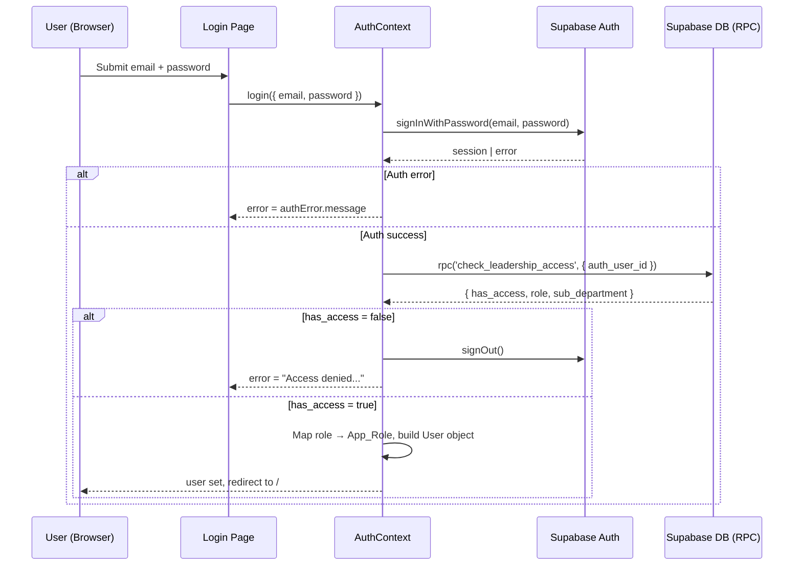
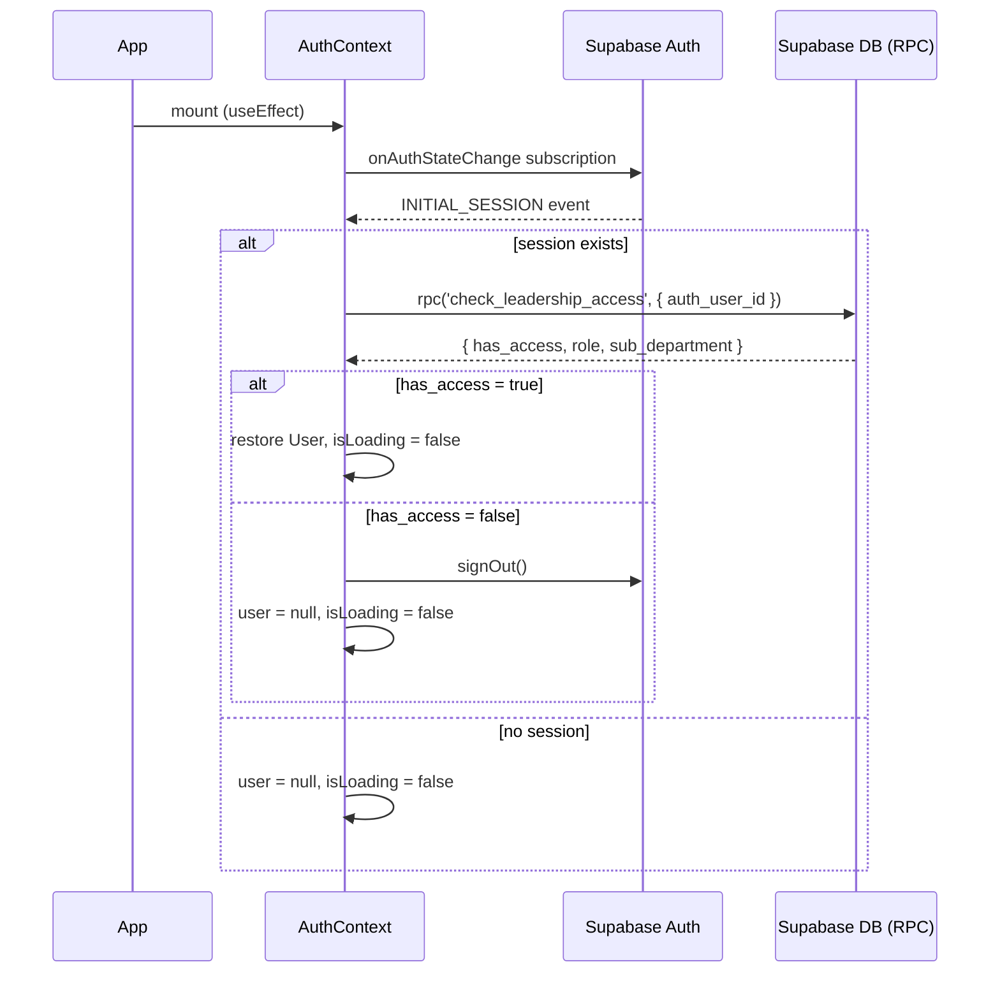
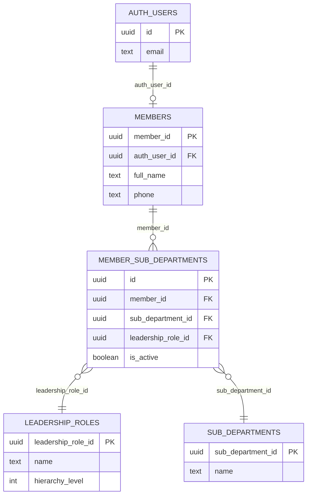

# Design Document — Authentication System

## Overview

The Authentication System for **Hitsanat KFL** is a two-phase access-control layer built on top of Supabase Auth. Phase 1 is standard email/password authentication handled entirely by Supabase. Phase 2 is a leadership access check: after Supabase issues a JWT, the client calls a server-side RPC function (`check_leadership_access`) that queries the ministry's relational schema to confirm the authenticated user holds a qualifying leadership role. Only users who pass both phases receive an application session.

The system replaces the deprecated `system_users` / `member_roles` table approach with a direct query against `members`, `member_sub_departments`, `leadership_roles`, and `sub_departments`. The `AuthContext` interface (`user`, `isLoading`, `login`, `logout`, `error`) is preserved so no other component requires changes.

### Key Design Decisions

- **Server-side access check via SECURITY DEFINER RPC**: Moving the leadership check into a PostgreSQL function prevents client-side bypass and keeps RLS policies simple. The function runs with elevated privileges so it can read `members` regardless of the calling user's row-level policies.
- **Single RPC call replaces four sequential queries**: The old `AuthContext` made 3–4 round-trips (system_users → members → member_roles → sub_departments). The new RPC collapses this into one call, reducing latency and eliminating partial-state bugs.
- **Access denied = immediate sign-out**: If the leadership check fails after Supabase Auth succeeds, the system calls `supabase.auth.signOut()` before setting the error. This prevents a state where a valid Supabase JWT exists but the app considers the user unauthenticated.
- **5-second timeout on the RPC call**: A `Promise.race` against a 5-second timer ensures a hanging database query never leaves the app in a permanent loading state.
- **`ProtectedRoute` as a wrapper component**: Rather than modifying every route definition, a single `ProtectedRoute` component wraps the `Layout` in `routes.tsx`, centralising the redirect and loading-spinner logic.

---

## Architecture



### Session Restore on Page Load



---

## Components and Interfaces

### `AuthContextValue` (unchanged public interface)

```typescript
interface AuthContextValue {
  user: User | null;
  isLoading: boolean;
  login: (userOrCredentials: User | { email: string; password: string }) => Promise<void>;
  logout: () => Promise<void>;
  error: string | null;
}
```

No consumer of `useAuth()` requires any changes.

### `AuthProvider` (`src/app/context/AuthContext.tsx`)

Responsibilities:
- Subscribe to `supabase.auth.onAuthStateChange` on mount; unsubscribe on unmount.
- On `INITIAL_SESSION` / `SIGNED_IN`: call `checkLeadershipAccess(session.user.id, session.user.email)`.
- On `SIGNED_OUT` / `TOKEN_REFRESHED` (with no session): clear user state.
- Expose `login` (calls `supabase.auth.signInWithPassword` in live mode; accepts a `User` object in demo mode) and `logout` (calls `supabase.auth.signOut`).

### `checkLeadershipAccess` (internal async helper)

```typescript
async function checkLeadershipAccess(
  authUserId: string,
  email: string
): Promise<User | null>
```

- Calls `supabase.rpc('check_leadership_access', { auth_user_id: authUserId })` with a 5-second timeout via `Promise.race`.
- On `has_access = true`: maps `role` + `sub_department` to `App_Role`, fetches member name, returns a `User` object.
- On `has_access = false` or RPC error: calls `supabase.auth.signOut()`, sets error message, returns `null`.

### `ProtectedRoute` (`src/app/components/ProtectedRoute.tsx`)

```typescript
export default function ProtectedRoute({ children }: { children: ReactNode }): JSX.Element
```

Rendering logic:
1. `isLoading === true` → render full-screen spinner.
2. `user === null` → `<Navigate to="/login" replace />`.
3. Otherwise → render `children`.

Used in `routes.tsx` to wrap the `Layout` component:

```typescript
{
  path: "/",
  element: <ProtectedRoute><Layout /></ProtectedRoute>,
  children: [ ... ]
}
```

The `/login` route sits outside this wrapper. The `Login` page itself redirects to `/` when `user` is already set.

### `Login` page (`src/app/pages/Login.tsx`)

No structural changes required. The form's `handleSubmit` already calls `login({ email, password })` from `useAuth()`. The `error` field from `useAuth()` is already rendered. The only wiring needed is adding a redirect when `user` is non-null:

```typescript
const { login, error, user, isLoading } = useAuth();
if (!isLoading && user) return <Navigate to="/" replace />;
```

---

## Data Models

### `check_leadership_access` RPC — Input / Output

**Input:**
```sql
auth_user_id UUID
```

**Output (JSON):**
```json
{
  "has_access": true,
  "role": "Chairperson",
  "sub_department": "Department"
}
```

| Field | Type | Description |
|---|---|---|
| `has_access` | `BOOLEAN` | `true` if the user holds at least one qualifying active role |
| `role` | `TEXT \| null` | `leadership_roles.name` of the highest-priority active role |
| `sub_department` | `TEXT \| null` | `sub_departments.name` of that role's sub-department |

### Role Mapping Table

| `role` (from RPC) | `sub_department` (from RPC) | `App_Role` |
|---|---|---|
| `Chairperson` | `Department` | `chairperson` |
| `Vice Chairperson` | `Department` | `vice-chairperson` |
| `Secretary` | `Department` | `secretary` |
| `Chairperson` | any other | `subdept-leader` |
| `Vice Chairperson` | any other | `subdept-vice-leader` |
| `Secretary` | any other | `subdept-vice-leader` |

Priority is determined by `leadership_roles.hierarchy_level` (lower value = higher priority). The RPC selects the highest-priority role before returning.

### `User` object (populated by `AuthContext`)

```typescript
interface User {
  id: string;           // members.member_id (UUID)
  name: string;         // members.full_name
  role: UserRole;       // mapped App_Role
  subDepartment?: string; // sub_departments.name (omitted when 'Department')
  email: string;        // auth.users.email
  phone: string;        // members.phone (or '' if unavailable)
}
```

### Database Schema (relevant tables)



### Migration: `006_auth_access_check.sql`

Creates the `check_leadership_access(auth_user_id UUID)` function with `SECURITY DEFINER`. The function:

1. Joins `members` → `member_sub_departments` → `leadership_roles` → `sub_departments` filtering on `auth_user_id` and `is_active = true`.
2. Excludes rows where `leadership_roles.name = 'Member'`.
3. Orders by `leadership_roles.hierarchy_level ASC` and takes the first row.
4. Returns `{ has_access: true, role, sub_department }` if a row is found, otherwise `{ has_access: false, role: null, sub_department: null }`.

Also updates the `handle_new_auth_user` trigger function (originally in `005_auth_trigger.sql`) to write `auth_user_id` directly into `members.auth_user_id` instead of inserting into the deprecated `system_users` table.

---

## Correctness Properties

*A property is a characteristic or behavior that should hold true across all valid executions of a system — essentially, a formal statement about what the system should do. Properties serve as the bridge between human-readable specifications and machine-verifiable correctness guarantees.*

### Property 1: Error messages are propagated without modification

*For any* error message string returned by `supabase.auth.signInWithPassword`, the `error` field exposed by `useAuth()` after a failed login attempt SHALL equal that exact string.

**Validates: Requirements 1.3**

---

### Property 2: Access granted produces a fully-populated User object

*For any* valid RPC response where `has_access` is `true`, the `user` object set in `AuthContext` SHALL be non-null and SHALL contain non-empty `id`, `name`, `role`, and `email` fields; `subDepartment` SHALL be set to the `sub_department` value when it is not `'Department'`, and SHALL be `undefined` when `sub_department` is `'Department'`.

**Validates: Requirements 2.2, 3.3**

---

### Property 3: Role mapping is correct for all valid (role, sub_department) combinations

*For any* `(role_name, sub_department_name)` pair drawn from the defined mapping table, the `mapToAppRole(role_name, sub_department_name)` function SHALL return the expected `App_Role` value as specified in the role mapping table.

**Validates: Requirements 3.1**

---

### Property 4: Highest-priority role is always selected

*For any* non-empty list of active role assignments (each with a `hierarchy_level`), the role selected by the access-check logic SHALL be the one with the minimum `hierarchy_level` value.

**Validates: Requirements 3.2**

---

### Property 5: Unauthenticated users are always redirected to /login

*For any* route path that is a Protected_Route (i.e., rendered under the `ProtectedRoute` wrapper), rendering that route with `user = null` and `isLoading = false` SHALL result in a redirect to `/login`.

**Validates: Requirements 5.1**

---

### Property 6: RPC return value always has the correct shape

*For any* `auth_user_id` passed to `check_leadership_access`, the returned JSON object SHALL always contain exactly the fields `has_access` (boolean), `role` (text or null), and `sub_department` (text or null), regardless of whether the user exists or holds qualifying roles.

**Validates: Requirements 7.3**

---

## Error Handling

| Scenario | Behaviour |
|---|---|
| Invalid credentials (Supabase Auth error) | Display `authError.message` in the login form; do not call RPC |
| RPC returns `has_access: false` | Call `signOut()`, set `error = "Access denied. You do not have permission to access this system."` |
| RPC returns a database error | Call `signOut()`, set `error = "Unable to verify access. Please try again."` |
| RPC does not respond within 5 seconds | Call `signOut()`, set `error = "Access check timed out. Please try again."` |
| `signOut()` itself fails | Swallow the error; still clear local `user` state and redirect to `/login` |
| Session restore on load — RPC fails | Treat as access denied; clear user, redirect to `/login` |
| `onAuthStateChange` fires `TOKEN_REFRESHED` with valid session | Re-run leadership check silently; if it now fails, sign out |

All error messages are stored in `AuthContext.error` and rendered by the `Login` page's existing error display block. No additional error UI components are needed.

---

## Testing Strategy

### Unit Tests (example-based)

These cover specific flows and integration points:

- `login()` calls `supabase.auth.signInWithPassword` with the correct arguments.
- After a successful Supabase sign-in, `supabase.rpc('check_leadership_access')` is called with the session's `user.id`.
- When `has_access = false`, `signOut()` is called and `error` is set to the access-denied message.
- When the RPC errors, `signOut()` is called and `error` is set to the retry message.
- When the RPC times out (5 s), access is denied.
- `logout()` calls `supabase.auth.signOut()` and clears `user`.
- When `signOut()` throws, `user` is still cleared.
- `INITIAL_SESSION` with a valid session triggers the leadership check and restores the user.
- `INITIAL_SESSION` with no session sets `user = null` and `isLoading = false`.
- `SIGNED_OUT` event clears `user`.
- Demo mode: `login(userObject)` sets `user` without calling Supabase.
- `ProtectedRoute` renders a spinner when `isLoading = true`.
- `ProtectedRoute` redirects to `/login` when `user = null` and not loading.
- `Login` page redirects to `/` when `user` is already set.

### Property-Based Tests

The property-based testing library for this project is **[fast-check](https://github.com/dubzzz/fast-check)** (TypeScript-native, works with Vitest).

Each property test runs a minimum of **100 iterations**.

Tag format: `// Feature: authentication-system, Property N: <property_text>`

**Property 1 — Error message propagation**
Generate arbitrary non-empty strings as mock Supabase error messages. For each, call `login()` with a mocked `signInWithPassword` that returns that error. Assert `useAuth().error === generatedMessage`.

**Property 2 — Access granted produces a fully-populated User object**
Generate arbitrary `{ has_access: true, role, sub_department }` objects (using valid role/sub_department values from the mapping table). For each, mock the RPC to return that response and mock member data. Assert the resulting `user` object has all required fields populated correctly.

**Property 3 — Role mapping correctness**
Generate all combinations of `(role_name, sub_department_name)` from the mapping table (this is a finite, enumerable set — fast-check's `fc.constantFrom` is appropriate). For each, call `mapToAppRole(role, subDept)` and assert the result matches the expected `App_Role`.

**Property 4 — Highest-priority role selection**
Generate non-empty arrays of role objects with random `hierarchy_level` values (integers 1–100). For each array, call the role-selection logic and assert the returned role has the minimum `hierarchy_level` in the array.

**Property 5 — Unauthenticated redirect**
Generate arbitrary route path strings (e.g., `/children`, `/members`, `/reports/xyz`). For each, render `<ProtectedRoute>` with `user = null` and `isLoading = false` at that path. Assert the rendered output is a redirect to `/login`.

**Property 6 — RPC return shape**
This property is validated at the database level via an integration test against a Supabase test instance (or a local Supabase CLI instance). For any `auth_user_id` (including UUIDs with no matching member), the function must return an object with exactly the three specified fields. This is an integration test rather than a unit property test because it tests the SQL function itself.

### Integration Tests

- `check_leadership_access` returns correct data for a known user with a qualifying role (run against local Supabase CLI).
- `check_leadership_access` returns `has_access: false` for a user with only a `Member` role.
- `check_leadership_access` returns `has_access: false` for an unknown `auth_user_id`.
- The updated auth trigger writes `auth_user_id` to `members` on new user creation.

### Smoke Tests

- `src/lib/supabase.ts` configures `persistSession: true`.
- `supabase/migrations/006_auth_access_check.sql` exists.
- The migration SQL contains `SECURITY DEFINER`.
- `AuthContext.tsx` contains no references to `system_users` or `member_roles`.
- `AuthContextValue` interface exposes `user`, `isLoading`, `login`, `logout`, `error`.
