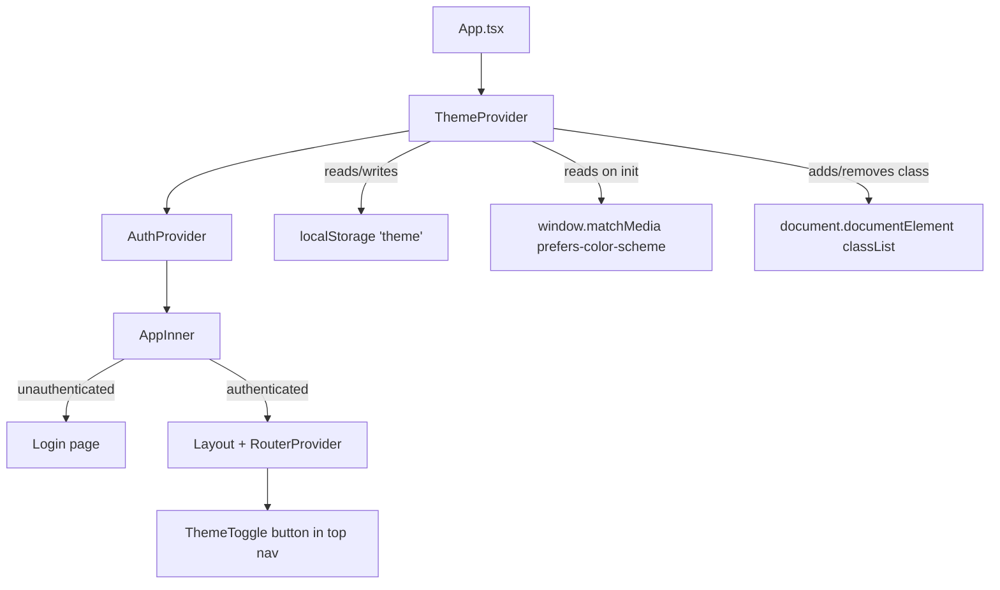

# Design Document: Dark / Light Mode

## Overview

This feature adds a user-controllable dark/light theme to the Hitsanat KFL Management System. The CSS custom properties for both themes already exist in `src/styles/theme.css` (`:root` for light, `.dark` class for dark). The implementation adds a `ThemeContext` that manages theme state, persists the preference to `localStorage`, detects the OS-level preference on first visit, and renders a toggle button in the top navigation bar.

The approach is intentionally minimal: the entire theme mechanism is a single class (`dark`) toggled on `document.documentElement`. No CSS variables are modified at runtime; the existing `theme.css` definitions handle all visual changes automatically.

## Architecture



`ThemeProvider` sits at the application root, above `AuthProvider`, so both the login page and the authenticated app share the same theme state.

## Components and Interfaces

### ThemeContext (`src/app/context/ThemeContext.tsx`)

```ts
type Theme = 'light' | 'dark';

interface ThemeContextValue {
  theme: Theme;
  toggleTheme: () => void;
}
```

- Reads initial theme from `localStorage` key `"theme"`.
- Falls back to `window.matchMedia('(prefers-color-scheme: dark)')` when no stored value exists.
- Falls back to `"light"` when `matchMedia` is unavailable.
- On every theme change: writes to `localStorage` and syncs the `dark` class on `document.documentElement`.
- Wraps the `localStorage` and `matchMedia` calls in try/catch to prevent crashes in restricted environments.

### ThemeToggle (`src/app/components/ThemeToggle.tsx`)

A single `<Button variant="ghost" size="icon">` that:
- Consumes `ThemeContext` via `useTheme()`.
- Renders a `Moon` icon when theme is `"light"` (clicking will switch to dark).
- Renders a `Sun` icon when theme is `"dark"` (clicking will switch to light).
- Has `aria-label="Switch to dark mode"` or `"Switch to light mode"` depending on current theme.
- Calls `toggleTheme()` on click.

### Changes to existing files

| File | Change |
|---|---|
| `src/app/App.tsx` | Wrap tree with `<ThemeProvider>` above `<AuthProvider>` |
| `src/app/components/Layout.tsx` | Import and render `<ThemeToggle>` in the top bar next to the existing icon buttons |

## Data Models

```ts
// Persisted value in localStorage under key "theme"
type StoredTheme = 'light' | 'dark';

// Runtime context value
interface ThemeContextValue {
  theme: 'light' | 'dark';
  toggleTheme: () => void;
}
```

No server-side data model is needed. The only persistence is a single string in `localStorage`.

### Initialization Logic

```
1. Try to read localStorage["theme"]
   - If "light" or "dark" → use it
   - If missing/invalid → go to step 2
   - If localStorage throws → go to step 2
2. Try window.matchMedia("(prefers-color-scheme: dark)").matches
   - If true  → "dark"
   - If false → "light"
   - If matchMedia unavailable → "light"
```

## Correctness Properties

*A property is a characteristic or behavior that should hold true across all valid executions of a system — essentially, a formal statement about what the system should do. Properties serve as the bridge between human-readable specifications and machine-verifiable correctness guarantees.*

### Property 1: Toggle is a round-trip

*For any* initial theme value, calling `toggleTheme` twice in succession should return the theme to its original value.

**Validates: Requirements 1.2, 1.4, 1.5**

### Property 2: DOM class always matches theme preference

*For any* theme value (`"light"` or `"dark"`), after the context applies the theme, `document.documentElement.classList.contains("dark")` should equal `theme === "dark"`.

**Validates: Requirements 2.1, 2.2, 7.1**

### Property 3: localStorage persistence round-trip

*For any* theme value, after `toggleTheme` is called, reading `localStorage.getItem("theme")` should return the new theme value.

**Validates: Requirements 3.1, 3.2, 3.3**

### Property 4: System preference used as fallback initial theme

*For any* `prefers-color-scheme` value (`"dark"` or `"light"`), when no value is stored in `localStorage`, the context should initialise the theme to match the system preference.

**Validates: Requirements 4.1, 4.2, 4.3**

### Property 5: Toggle icon reflects the opposite of the current theme

*For any* theme state, the `ThemeToggle` component should render a `Moon` icon when the theme is `"light"` and a `Sun` icon when the theme is `"dark"`.

**Validates: Requirements 5.2, 5.3**

### Property 6: Toggle aria-label describes the forthcoming action

*For any* theme state, the `ThemeToggle` button's `aria-label` should describe switching to the *opposite* theme (e.g., `"Switch to dark mode"` when currently light).

**Validates: Requirements 5.5**

### Property 7: Theme context does not modify CSS custom properties

*For any* theme change, the only DOM mutation performed by `ThemeContext` should be adding or removing the `"dark"` class on `document.documentElement` — no inline styles or CSS variable overrides should be written.

**Validates: Requirements 7.3**

## Error Handling

| Scenario | Behaviour |
|---|---|
| `localStorage.getItem` throws (e.g., private browsing restrictions) | Caught silently; falls back to system preference detection |
| `localStorage.setItem` throws on write | Caught silently; theme state still updates in memory and DOM |
| `window.matchMedia` is undefined (SSR / old browser) | Guarded with `typeof window !== 'undefined'` check; defaults to `"light"` |
| `ThemeContext` consumed outside `ThemeProvider` | `useTheme()` throws a descriptive error: `"useTheme must be used inside ThemeProvider"` |

## Testing Strategy

### Dual Testing Approach

Both unit tests and property-based tests are used. Unit tests cover specific examples and integration points; property-based tests verify universal invariants across many generated inputs.

### Unit Tests

- `ThemeContext` initialises to `"dark"` when `localStorage` contains `"dark"`.
- `ThemeContext` initialises to `"light"` when `localStorage` contains `"light"`.
- `ThemeContext` falls back to system preference when `localStorage` is empty.
- `ThemeContext` falls back to `"light"` when both `localStorage` and `matchMedia` are unavailable.
- `ThemeContext` does not crash when `localStorage` throws on read or write.
- `ThemeToggle` renders in the `Layout` top bar.
- Clicking `ThemeToggle` calls `toggleTheme`.
- `ThemeProvider` is present above `AuthProvider` in `App`.

### Property-Based Tests

Property-based testing library: **fast-check** (already compatible with Vitest).

Each property test runs a minimum of **100 iterations**.

Each test is tagged with a comment in the format:
`// Feature: dark-light-mode, Property <N>: <property_text>`

| Property | Test description |
|---|---|
| P1 – Toggle round-trip | Generate a random initial theme; call `toggleTheme` twice; assert theme equals initial value |
| P2 – DOM class sync | For each of `"light"` and `"dark"`, set theme and assert `classList.contains("dark")` matches |
| P3 – localStorage round-trip | Generate a random theme; call `toggleTheme`; assert `localStorage["theme"]` equals new theme |
| P4 – System preference fallback | Mock `matchMedia` with random dark/light result; mount with empty storage; assert initial theme matches mock |
| P5 – Toggle icon | For each theme value, render `ThemeToggle` and assert correct icon is present |
| P6 – aria-label | For each theme value, render `ThemeToggle` and assert `aria-label` references the opposite theme |
| P7 – No CSS mutation | After any number of toggles, assert `document.documentElement` has no `style` attribute mutations from the context |
