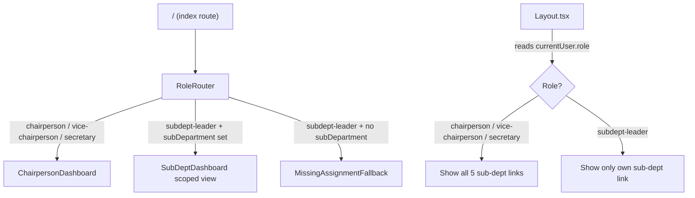

# Design Document: Dashboard Role Separation

## Overview

This feature splits the single unified `Dashboard.tsx` into two distinct views driven by the `currentUser` object from `mockData.ts`:

- **Chairperson_Dashboard** — shown to `chairperson`, `vice-chairperson`, and `secretary` roles. Displays org-wide aggregate metrics, all sub-department activity, and navigation to each sub-department dashboard.
- **SubDept_Dashboard** — shown to `subdept-leader` roles. Scoped entirely to the user's assigned sub-department, showing only that department's members, programs, tasks, and charts.

The routing decision happens at the root `/` route. No login flow is introduced; the role is read directly from `currentUser`. The existing `SubDepartmentDashboard.tsx` page (accessed via `/subdepartment/:id`) is retained and enhanced to support the scoped leader view.

---

## Architecture

The role-dispatch logic lives in a thin wrapper component (`RoleRouter`) rendered at the `/` index route. It reads `currentUser.role` and renders the appropriate dashboard component. This keeps routing declarative and avoids scattering role checks across the codebase.



The `Layout.tsx` sidebar is updated in parallel: it reads `currentUser.role` to conditionally render sub-department navigation links.

---

## Components and Interfaces

### RoleRouter (new — `src/app/pages/RoleRouter.tsx`)

A stateless component that dispatches to the correct dashboard.

```ts
// No props — reads currentUser directly from mockData
export default function RoleRouter(): JSX.Element
```

Logic:
- `chairperson | vice-chairperson | secretary` → render `<ChairpersonDashboard />`
- `subdept-leader` with `currentUser.subDepartment` set → render `<SubDeptDashboard subDepartmentName={currentUser.subDepartment} />`
- `subdept-leader` with no `subDepartment` → render inline fallback message

### ChairpersonDashboard (rename/refactor of `Dashboard.tsx`)

The existing `Dashboard.tsx` becomes `ChairpersonDashboard.tsx`. The component is cleaned up to remove the role badge (now handled by Layout) and to add explicit navigation links to each sub-department dashboard.

Key sections:
- Aggregate stat cards (total children, members, programs, events)
- Per-sub-department activity summary with progress bars
- Member distribution pie chart
- Attendance trend line chart
- Upcoming programs and events lists
- Quick-actions panel
- Sub-department navigation cards (new — links to `/subdepartment/:id`)

### SubDeptDashboard (scoped entry point — `src/app/pages/SubDepartmentDashboard.tsx`)

The existing `SubDepartmentDashboard.tsx` already handles the `/subdepartment/:id` route. For the role-based root route, `RoleRouter` will render it by passing the sub-department name derived from `currentUser.subDepartment`, which is then resolved to the matching `SubDepartment` object.

The component already supports:
- Scoped member and program lists
- Leadership team display
- Activity charts
- Task list
- Management controls gated on `isLeader`

Changes needed:
- Accept an optional `subDepartmentName` prop (in addition to the existing `useParams` path) so `RoleRouter` can render it without a URL param
- Apply the sub-department name display mapping (Requirement 6)
- Ensure the two-letter avatar uses the first two characters of the display name

### Layout.tsx (updated)

The sub-department navigation section is made role-aware:

```ts
const visibleSubDepts = currentUser.role === 'subdept-leader'
  ? subDepartments.filter(sd => sd.name === currentUser.subDepartment)
  : subDepartments; // chairperson / vice-chairperson / secretary see all
```

### Sub-Department Name Mapping (shared utility)

A pure mapping function used by both `ChairpersonDashboard` and `SubDeptDashboard`:

```ts
// src/app/data/mockData.ts (or a new utils file)
export const SUBDEPT_DISPLAY_NAMES: Record<string, string> = {
  Timhert: 'Timhert Academic',
  Mezmur: 'Tmezmur',
  Kinetibeb: 'Kinetibeb',
  Kuttr: 'Kuttr',
  Ekd: 'EKD',
};

export function getSubDeptDisplayName(name: string): string {
  return SUBDEPT_DISPLAY_NAMES[name] ?? name;
}
```

---

## Data Models

No new data models are introduced. The feature relies entirely on existing types from `mockData.ts`.

Relevant existing types:

```ts
type UserRole = 'chairperson' | 'vice-chairperson' | 'secretary' | 'subdept-leader' | 'member';

interface User {
  id: string;
  name: string;
  role: UserRole;
  subDepartment?: string; // matches SubDepartment.name
  email: string;
  phone: string;
}

interface SubDepartment {
  id: string;
  name: 'Timhert' | 'Mezmur' | 'Kinetibeb' | 'Kuttr' | 'Ekd';
  chairperson: string;
  viceChairperson: string;
  secretary: string;
  memberCount: number;
  description: string;
  color: string;
}
```

The `currentUser.subDepartment` value is a string that matches `SubDepartment.name` (e.g., `'Timhert'`). The display name mapping is applied at render time only.

To simulate different roles during development, the `currentUser` export in `mockData.ts` is changed manually (as it is today).

---

## Correctness Properties

*A property is a characteristic or behavior that should hold true across all valid executions of a system — essentially, a formal statement about what the system should do. Properties serve as the bridge between human-readable specifications and machine-verifiable correctness guarantees.*

### Property 1: Chairperson roles see ChairpersonDashboard

*For any* user whose role is `chairperson`, `vice-chairperson`, or `secretary`, rendering `RoleRouter` should produce the `ChairpersonDashboard` component, not the `SubDeptDashboard`.

**Validates: Requirements 1.1, 1.3**

### Property 2: Sub-department leader sees scoped dashboard

*For any* user whose role is `subdept-leader` and who has a non-empty `subDepartment` value, rendering `RoleRouter` should produce the `SubDeptDashboard` scoped to that sub-department.

**Validates: Requirements 1.2**

### Property 3: Missing sub-department assignment shows fallback

*For any* user whose role is `subdept-leader` and whose `subDepartment` is undefined or empty, rendering `RoleRouter` should produce a fallback message (not a crash and not the `SubDeptDashboard`).

**Validates: Requirements 1.4**

### Property 4: Chairperson dashboard contains all sub-department links

*For any* rendered `ChairpersonDashboard`, navigation links to all five sub-departments should be present in the output.

**Validates: Requirements 2.5**

### Property 5: Chairperson dashboard shows all aggregate stats

*For any* rendered `ChairpersonDashboard`, the four aggregate stat cards (total children, total members, upcoming programs, upcoming events) should all be present and non-empty.

**Validates: Requirements 2.1, 2.2, 2.6**

### Property 6: SubDeptDashboard members are scoped to the sub-department

*For any* sub-department, the members list rendered by `SubDeptDashboard` should contain only members whose `subDepartments` array includes that sub-department's name, and no members from other sub-departments.

**Validates: Requirements 3.1, 3.2**

### Property 7: SubDeptDashboard programs are scoped to the sub-department

*For any* sub-department, the programs list rendered by `SubDeptDashboard` should contain only programs whose `subDepartmentId` matches that sub-department's id.

**Validates: Requirements 3.3**

### Property 8: Management controls visibility matches leader status

*For any* rendered `SubDeptDashboard`, management controls (add task, schedule program, export report) should be visible if and only if the current user is a `subdept-leader` whose `subDepartment` matches the displayed sub-department.

**Validates: Requirements 3.8**

### Property 9: SubDeptDashboard reflects sub-department identity

*For any* sub-department, the rendered `SubDeptDashboard` should display the correct display name as the heading, the description as the subtitle, the department color applied to accent elements, and a two-letter avatar derived from the sub-department name.

**Validates: Requirements 4.1, 4.2, 4.3, 4.4**

### Property 10: Layout shows correct sub-department links per role

*For any* user with role `chairperson`, `vice-chairperson`, or `secretary`, the Layout sidebar should contain links to all five sub-departments. For any `subdept-leader`, the sidebar should contain a link only to their own sub-department.

**Validates: Requirements 5.1, 5.2, 5.4**

### Property 11: Sub-department name mapping is correct

*For any* sub-department in `mockData.ts`, calling `getSubDeptDisplayName` with the internal name should return the specified display name (Timhert→"Timhert Academic", Mezmur→"Tmezmur", Kinetibeb→"Kinetibeb", Ekd→"EKD", Kuttr→"Kuttr").

**Validates: Requirements 6.1, 6.2, 6.3, 6.4, 6.5**

---

## Error Handling

- **Missing sub-department assignment**: `RoleRouter` checks `currentUser.subDepartment` before rendering `SubDeptDashboard`. If absent, it renders a clear inline message: "Sub-department not assigned. Please contact your administrator." No crash, no blank screen.
- **Unknown sub-department ID in URL**: The existing `SubDepartmentDashboard.tsx` already handles this with a "Sub-department not found" message. This behavior is preserved.
- **Unknown role**: If `currentUser.role` is not one of the five known values, `RoleRouter` falls back to rendering `ChairpersonDashboard` as a safe default.
- **Empty data arrays**: All list renders (members, programs, events) handle empty arrays with appropriate empty-state UI (already present in the existing components).

---

## Testing Strategy

### Unit Tests

Focus on specific examples, edge cases, and integration points:

- `RoleRouter` renders `ChairpersonDashboard` for `chairperson`, `vice-chairperson`, `secretary`
- `RoleRouter` renders `SubDeptDashboard` for `subdept-leader` with a valid `subDepartment`
- `RoleRouter` renders the fallback message for `subdept-leader` with no `subDepartment`
- `getSubDeptDisplayName` returns correct display names for all five internal names
- `getSubDeptDisplayName` returns the input unchanged for unknown names
- Layout sidebar shows all 5 sub-dept links for chairperson role
- Layout sidebar shows only 1 sub-dept link for subdept-leader role

### Property-Based Tests

Use [fast-check](https://github.com/dubzzz/fast-check) (TypeScript-native PBT library). Each test runs a minimum of 100 iterations.

Each test is tagged with a comment in the format:
`// Feature: dashboard-role-separation, Property N: <property text>`

**Property 1** — `RoleRouter` role dispatch for org-wide roles
Generate random users with role in `['chairperson', 'vice-chairperson', 'secretary']`. Assert `RoleRouter` renders `ChairpersonDashboard`.
`// Feature: dashboard-role-separation, Property 1: Chairperson roles see ChairpersonDashboard`

**Property 2** — `RoleRouter` role dispatch for sub-department leaders
Generate random `subdept-leader` users with a valid `subDepartment` from the five known values. Assert `RoleRouter` renders `SubDeptDashboard` scoped to that sub-department.
`// Feature: dashboard-role-separation, Property 2: Sub-department leader sees scoped dashboard`

**Property 3** — Fallback for missing sub-department
Generate `subdept-leader` users with `subDepartment` set to `undefined` or `''`. Assert fallback message is rendered.
`// Feature: dashboard-role-separation, Property 3: Missing sub-department assignment shows fallback`

**Property 4** — All sub-department links present in ChairpersonDashboard
Render `ChairpersonDashboard` with any valid mock data. Assert all five sub-department names appear as links.
`// Feature: dashboard-role-separation, Property 4: Chairperson dashboard contains all sub-department links`

**Property 6** — Member scoping in SubDeptDashboard
For each of the five sub-departments, render `SubDeptDashboard` and assert every displayed member belongs to that sub-department.
`// Feature: dashboard-role-separation, Property 6: SubDeptDashboard members are scoped to the sub-department`

**Property 7** — Program scoping in SubDeptDashboard
For each of the five sub-departments, render `SubDeptDashboard` and assert every displayed program has the matching `subDepartmentId`.
`// Feature: dashboard-role-separation, Property 7: SubDeptDashboard programs are scoped to the sub-department`

**Property 8** — Management controls visibility
Generate users with varying roles and sub-department assignments. Assert management controls are visible iff the user is a matching `subdept-leader`.
`// Feature: dashboard-role-separation, Property 8: Management controls visibility matches leader status`

**Property 9** — Sub-department identity rendering
For each of the five sub-departments, render `SubDeptDashboard` and assert the display name, description, color, and two-letter avatar are all correct.
`// Feature: dashboard-role-separation, Property 9: SubDeptDashboard reflects sub-department identity`

**Property 10** — Layout sidebar link visibility
Generate users with all possible roles. Assert sidebar link counts match the role rules (5 links for org roles, 1 link for subdept-leader).
`// Feature: dashboard-role-separation, Property 10: Layout shows correct sub-department links per role`

**Property 11** — Name mapping correctness
For each of the five `(internalName, expectedDisplayName)` pairs, assert `getSubDeptDisplayName` returns the correct value.
`// Feature: dashboard-role-separation, Property 11: Sub-department name mapping is correct`
