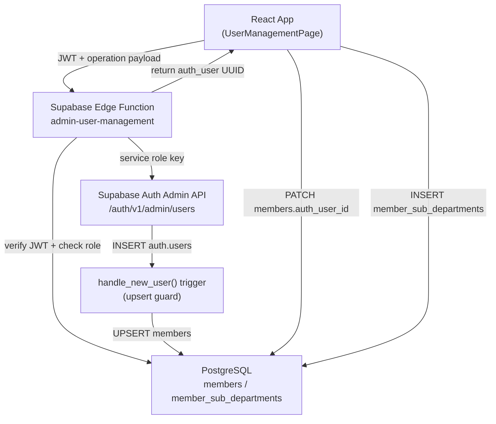

# Design Document

## Supabase Auth User Creation

---

## Overview

This feature adds an admin-controlled UI page for provisioning Supabase Auth accounts for ministry members. The page lives inside the existing React application and is accessible only to department-level leaders (Chairperson, Vice Chairperson, Secretary of the `Department` sub-department).

Two workflows are supported:

1. **Link existing member** — a `members` row already exists; the admin creates an `auth.users` entry and links it via `members.auth_user_id`.
2. **Create new member with login** — a brand-new `members` row and `auth.users` entry are created together, relying on the `handle_new_user()` trigger for the `members` insert.

All Supabase Admin API calls (which require the service role key) are routed through a Deno Edge Function so the secret never reaches the browser. The existing `RoleAssignmentDialog` component is reused for post-creation role assignment.

---

## Architecture



**Key design decisions:**

- The Edge Function is the only place the `SUPABASE_SERVICE_ROLE_KEY` is used. It verifies the caller's JWT and checks their department role before executing any Admin API call.
- The `handle_new_user()` trigger is upgraded to an upsert: if a `members` row with the same email already exists, it updates `auth_user_id` instead of inserting a duplicate.
- Role assignment after creation reuses the existing `RoleAssignmentDialog` component unchanged.
- The React page uses the existing `useMembers` hook for member queries and the existing `supabase` client for direct table reads (members list, sub-departments).

---

## Components and Interfaces

### New Page: `UserManagementPage`

**Path:** `src/app/pages/UserManagementPage.tsx`

Renders two tabs:
- **Unlinked Members** — members with `auth_user_id IS NULL`
- **Linked Members** — members with `auth_user_id IS NOT NULL`

Access guard: redirects to `/` if the current user's role is not `chairperson`, `vice-chairperson`, or `secretary`.

Action visibility:
- "Create Account" button and "Assign Role" option: visible only to `chairperson`.
- "Reset Password" option: visible to all three admin roles.

**Props:** none (reads from `useAuth()`)

**State:**
```typescript
interface PageState {
  unlinkedMembers: UnlinkedMember[];
  linkedMembers: LinkedMember[];
  searchTerm: string;
  isLoading: boolean;
  createDialogOpen: boolean;
  resetDialogOpen: boolean;
  roleDialogMemberId: string | null;
  selectedMember: UnlinkedMember | LinkedMember | null;
}
```

---

### New Component: `CreateAccountDialog`

**Path:** `src/app/components/CreateAccountDialog.tsx`

A modal dialog with two modes toggled by a tab:
- **Link existing member** — pre-fills email from the selected member, accepts password.
- **Create new member** — accepts `full_name`, `email`, `password`.

On submit, calls the Edge Function via `callAdminFunction('create_user', payload)`.

On success, calls `onSuccess(memberId: string)` which triggers `RoleAssignmentDialog`.

---

### New Component: `ResetPasswordDialog`

**Path:** `src/app/components/ResetPasswordDialog.tsx`

A modal dialog that accepts `newPassword` and `confirmPassword`. Calls `callAdminFunction('update_password', { auth_user_id, new_password })` on submit.

---

### New Utility: `adminApi.ts`

**Path:** `src/app/lib/adminApi.ts`

```typescript
export async function callAdminFunction(
  operation: 'create_user' | 'update_password',
  payload: Record<string, unknown>
): Promise<{ data: unknown; error: string | null }>
```

Retrieves the current session JWT from `supabase.auth.getSession()` and sends a `POST` to the Edge Function URL with `Authorization: Bearer <jwt>`.

---

### New Edge Function: `admin-user-management`

**Path:** `supabase/functions/admin-user-management/index.ts`

**Operations:**

| Operation | Required role | Action |
|---|---|---|
| `create_user` | Chairperson of Department | Creates auth user via Admin API; returns `{ auth_user_id }` |
| `update_password` | Any dept leader | Updates auth user password via Admin API |

**Request body:**
```typescript
// create_user
{ operation: 'create_user', email: string, password: string, full_name?: string }

// update_password
{ operation: 'update_password', auth_user_id: string, new_password: string }
```

**Authorization flow:**
1. Extract JWT from `Authorization` header.
2. Call `supabase.auth.getUser(jwt)` to get `auth_user_id`.
3. Query `members → member_sub_departments → leadership_roles → sub_departments` to determine the caller's role.
4. For `create_user`: require `Chairperson` of `Department`; otherwise return 403.
5. For `update_password`: require any of `Chairperson`, `Vice Chairperson`, `Secretary` of `Department`; otherwise return 403.

**CORS:** Allow `https://<app-domain>` and `http://localhost:*`.

---

### New Migration: `handle_new_user` upsert guard

**Path:** `supabase/migrations/008_handle_new_user_upsert.sql`

Replaces the existing `handle_new_user()` function with an upsert version:

```sql
CREATE OR REPLACE FUNCTION public.handle_new_user()
RETURNS TRIGGER AS $$
BEGIN
  INSERT INTO public.members (email, full_name, auth_user_id)
  VALUES (
    NEW.email,
    COALESCE(NEW.raw_user_meta_data->>'full_name', NEW.email),
    NEW.id
  )
  ON CONFLICT (email)
  DO UPDATE SET auth_user_id = EXCLUDED.auth_user_id
  WHERE public.members.auth_user_id IS NULL;
  RETURN NEW;
END;
$$ LANGUAGE plpgsql SECURITY DEFINER;
```

The `ON CONFLICT (email) DO UPDATE` clause requires a unique constraint on `members.email`, which already exists in the schema (`email TEXT UNIQUE NOT NULL`).

---

### Route Registration

Add to `src/app/App.tsx`:
```tsx
<Route path="/user-management" element={
  <ProtectedRoute allowedRoles={['chairperson', 'vice-chairperson', 'secretary']}>
    <UserManagementPage />
  </ProtectedRoute>
} />
```

Add to navigation in `src/app/components/Layout.tsx` for `chairperson`, `vice-chairperson`, `secretary` roles.

---

### New Permission Helper

Add to `src/app/lib/permissions.ts`:
```typescript
/** Can access the user management page (create accounts, reset passwords) */
export function canAccessUserManagement(role: UserRole): boolean {
  return role === 'chairperson' || role === 'vice-chairperson' || role === 'secretary';
}

/** Can create auth accounts and assign roles (Chairperson only) */
export function canCreateAuthAccounts(role: UserRole): boolean {
  return role === 'chairperson';
}
```

---

## Data Models

### Existing tables used (no schema changes needed)

```
members
  id              UUID PK
  email           TEXT UNIQUE NOT NULL
  full_name       TEXT NOT NULL
  auth_user_id    UUID UNIQUE REFERENCES auth.users(id) ON DELETE SET NULL

member_sub_departments
  id              UUID PK
  member_id       UUID REFERENCES members(id)
  sub_department_id UUID REFERENCES sub_departments(id)
  role_id         UUID REFERENCES leadership_roles(id)
  is_active       BOOLEAN DEFAULT true

sub_departments
  id              UUID PK
  name            TEXT UNIQUE NOT NULL

leadership_roles
  id              UUID PK
  name            TEXT UNIQUE NOT NULL   -- 'Chairperson' | 'Vice Chairperson' | 'Secretary' | 'Member'
  hierarchy_level INTEGER
```

> **Note on column naming:** The main schema file (`deepseek_sql_20260424_7a7bde.sql`) uses `id` as the PK for `members`, while migration `007_rls_and_access_functions.sql` references `member_id`. The design uses `id` (matching the main schema). The Edge Function and migration queries must be consistent with the live schema.

### New data flow for "link existing member"

```
Admin submits form
  → Edge Function creates auth.users row (returns auth_user_id)
  → handle_new_user() trigger fires:
      email exists in members → UPDATE members SET auth_user_id = NEW.id WHERE auth_user_id IS NULL
  → React client: no additional PATCH needed (trigger handles it)
  → React opens RoleAssignmentDialog with member.id
```

### New data flow for "create new member"

```
Admin submits form (full_name, email, password)
  → Edge Function creates auth.users row with user_metadata.full_name
  → handle_new_user() trigger fires:
      email NOT in members → INSERT INTO members (email, full_name, auth_user_id)
  → React opens RoleAssignmentDialog with the new member's id
      (fetched by querying members WHERE auth_user_id = returned_uuid)
```

---

## Correctness Properties

*A property is a characteristic or behavior that should hold true across all valid executions of a system — essentially, a formal statement about what the system should do. Properties serve as the bridge between human-readable specifications and machine-verifiable correctness guarantees.*

### Property 1: Access control is role-exhaustive

*For any* authenticated user role, the user management page SHALL be accessible if and only if the role is `chairperson`, `vice-chairperson`, or `secretary`. No other role shall gain access.

**Validates: Requirements 1.1, 1.2**

---

### Property 2: Create/assign actions are Chairperson-exclusive

*For any* admin role rendered on the user management page, the "Create Account" and "Assign Role" actions SHALL be visible if and only if the role is `chairperson`.

**Validates: Requirements 1.3, 6.6**

---

### Property 3: Edge Function rejects non-department-leaders

*For any* JWT that does not correspond to a `Chairperson`, `Vice Chairperson`, or `Secretary` of the `Department` sub-department, the Edge Function SHALL return HTTP 403 for all operations.

**Validates: Requirements 1.7, 8.2, 8.3**

---

### Property 4: Edge Function rejects non-Chairpersons for create_user

*For any* JWT that corresponds to a `Vice Chairperson` or `Secretary` (even of `Department`), calling `create_user` on the Edge Function SHALL return HTTP 403.

**Validates: Requirements 1.7, 8.4**

---

### Property 5: Unlinked member list is exactly the set with null auth_user_id

*For any* set of members in the database, the unlinked member list displayed on the page SHALL contain exactly those members whose `auth_user_id` is `NULL` — no more, no fewer.

**Validates: Requirements 2.1**

---

### Property 6: Unlinked member rows display required fields

*For any* unlinked member, the rendered row SHALL include the member's `full_name`, `email`, and all active sub-department role assignments.

**Validates: Requirements 2.2**

---

### Property 7: Duplicate member guard — idempotence

*For any* valid email address, executing the `handle_new_user()` trigger twice with the same email SHALL result in exactly one `members` row with that email.

**Validates: Requirements 5.5, 3.3**

---

### Property 8: Password validator is correct for all inputs

*For any* string, the client-side password validator SHALL accept it if and only if it satisfies all four criteria simultaneously: length ≥ 8, contains at least one uppercase letter, contains at least one digit, and contains at least one special character.

**Validates: Requirements 3.5, 4.4, 7.2, 9.2**

---

### Property 9: Email validator is correct for all inputs

*For any* string, the client-side email validator SHALL accept it if and only if it is a syntactically valid email address (RFC 5322 simplified).

**Validates: Requirements 9.1**

---

### Property 10: Search filter is exact

*For any* search term and member list, the filtered result SHALL contain exactly those members whose `full_name` or `email` contains the search term (case-insensitive), and no members that do not match.

**Validates: Requirements 10.4**

---

**Property Reflection:**

- Properties 3 and 4 are distinct: Property 3 covers non-department-leaders (all operations), Property 4 covers department-level non-Chairpersons specifically for `create_user`. They are not redundant.
- Properties 7 covers both 5.5 (explicit idempotence) and 3.3 (no duplicate on link). These are the same underlying invariant, so they are consolidated into one property.
- Properties 8 and 9 are independent validators with different input spaces and rules.

---

## Error Handling

### Client-side validation errors (shown inline)

| Condition | Message |
|---|---|
| Email field empty | "Email is required" |
| Email format invalid | "Enter a valid email address" |
| Password too short | "Password must be at least 8 characters" |
| Password missing uppercase | "Password must contain at least one uppercase letter" |
| Password missing digit | "Password must contain at least one digit" |
| Password missing special char | "Password must contain at least one special character" |
| Passwords do not match (reset) | "Passwords do not match" |
| Full name empty (new member) | "Full name is required" |

### Edge Function / API errors (shown as toast)

| Condition | Message |
|---|---|
| Email already registered (create) | "This email is already registered. Use a different email or link the existing account." |
| Email already registered (new member) | "This email is already registered." |
| Edge Function returns 403 | "You do not have permission to perform this action." |
| Edge Function returns 401 | "Session expired. Please log in again." |
| Network error | "Network error. Please check your connection and try again." |
| Any other API error | Forward the error message from the Edge Function response body |

### Form state preservation

On any failed submission, the form retains all previously entered values so the admin can correct and resubmit without re-entering data.

### Role assignment skip warning

When the admin closes `RoleAssignmentDialog` without assigning a role, a persistent inline warning is shown: "This user will not be able to log in until a leadership role is assigned."

---

## Testing Strategy

### Unit tests (example-based)

- `UserManagementPage` renders correctly for each of the three admin roles (chairperson, vice-chairperson, secretary).
- `UserManagementPage` redirects to `/` for non-admin roles.
- `CreateAccountDialog` pre-fills email from selected member.
- `CreateAccountDialog` shows success state and calls `onSuccess` with the correct member ID.
- `ResetPasswordDialog` shows "Passwords do not match" when entries differ.
- `adminApi.callAdminFunction` attaches the JWT from the current session.
- Empty unlinked list shows the empty-state message.
- After successful creation, the member is removed from the unlinked list.
- Skipping role assignment shows the warning message.

### Property-based tests (using `fast-check`)

The feature involves pure validation logic and data-filtering functions that are well-suited for property-based testing. Use `fast-check` (already available in the JS ecosystem) with a minimum of 100 iterations per property.

Each property test is tagged with:
`// Feature: supabase-auth-user-creation, Property N: <property text>`

**Property 1 — Access control is role-exhaustive**
Generate random `UserRole` values. Assert `canAccessUserManagement(role)` returns `true` iff role ∈ `{chairperson, vice-chairperson, secretary}`.

**Property 2 — Create/assign actions are Chairperson-exclusive**
Generate random `UserRole` values. Assert `canCreateAuthAccounts(role)` returns `true` iff role === `chairperson`.

**Property 5 — Unlinked list is exactly null-auth_user_id members**
Generate random arrays of member objects with mixed `auth_user_id` values (null or UUID string). Assert the filter function returns exactly those with `auth_user_id === null`.

**Property 7 — Duplicate member guard idempotence**
Test the `handle_new_user()` upsert logic with generated email strings. Assert that calling the upsert logic twice with the same email results in exactly one row.

**Property 8 — Password validator correctness**
Generate random strings (including edge cases: empty, whitespace-only, all-lowercase, all-digits, etc.). Assert `validatePassword(s)` returns `true` iff all four criteria are met.

**Property 9 — Email validator correctness**
Generate random strings. Assert `validateEmail(s)` returns `true` iff the string matches a valid email pattern.

**Property 10 — Search filter is exact**
Generate random member arrays and search terms. Assert the filter returns exactly those members whose `full_name` or `email` contains the term (case-insensitive).

### Integration tests

- Edge Function returns 403 for non-department-leader JWT (1–2 examples).
- Edge Function returns 403 for vice-chairperson calling `create_user` (1 example).
- Edge Function successfully creates an auth user and returns the UUID (1 example with test credentials).
- Edge Function successfully updates a password (1 example).
- `handle_new_user()` trigger: inserting an auth user for an existing member email updates `auth_user_id` without creating a duplicate row.
- `handle_new_user()` trigger: inserting an auth user for a new email creates a new `members` row.

### Smoke tests

- `supabase/functions/admin-user-management/index.ts` exists and deploys without errors.
- `SUPABASE_SERVICE_ROLE_KEY` is not present in any client-side bundle (verified by `grep` in CI).
- Migration `008_handle_new_user_upsert.sql` applies cleanly to the database.
