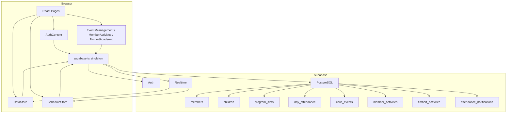

# Design Document: Supabase Backend Integration

## Overview

This design replaces the in-memory/localStorage data layer of the Hitsanat KFL Management System with Supabase (PostgreSQL + Auth + Realtime). The core constraint is **API surface preservation**: the three React contexts (`AuthContext`, `DataStore`, `ScheduleStore`) must continue to expose the same hooks and values so that all existing page components work without modification.

The integration is structured in three layers:

1. **Infrastructure** — Supabase client singleton, schema migrations, RLS policies, seed data
2. **Context layer** — Updated `AuthContext`, `DataStore`, `ScheduleStore` that talk to Supabase instead of localStorage
3. **Page-level queries** — `EventsManagement`, `MemberActivities`, `TimhertAcademic` pages that currently read directly from `mockData.ts` arrays and need their own Supabase fetch/mutation hooks

A **demo mode** flag (`VITE_DEMO_MODE=true`) preserves the existing preset-user card login flow for local development without a live Supabase project.

---

## Architecture



**Data flow for writes (optimistic):**
1. Context updates local state immediately (optimistic)
2. Supabase write is issued asynchronously
3. On error: local state is reverted and `lastError` is set
4. Realtime subscription keeps other sessions in sync

**Demo mode bypass:**
- When `VITE_DEMO_MODE === "true"`, `AuthContext` skips Supabase entirely and uses the existing preset-user card flow
- `DataStore` and `ScheduleStore` fall back to localStorage when no Supabase session is present

---

## Components and Interfaces

### `src/lib/supabase.ts`

```typescript
import { createClient } from '@supabase/supabase-js';

const url = import.meta.env.VITE_SUPABASE_URL;
const key = import.meta.env.VITE_SUPABASE_ANON_KEY;

if (!url) throw new Error('Missing env var: VITE_SUPABASE_URL');
if (!key) throw new Error('Missing env var: VITE_SUPABASE_ANON_KEY');

export const supabase = createClient(url, key, {
  auth: { persistSession: true },
});
```

### Updated `AuthContext`

The context value interface is **unchanged**:

```typescript
interface AuthContextValue {
  user: User | null;
  login: (userOrCredentials: User | { email: string; password: string }) => Promise<void>;
  logout: () => Promise<void>;
  error: string | null; // new — exposed for Login page error display
}
```

Behaviour:
- On mount: calls `supabase.auth.getSession()` to restore session
- `login`: in demo mode accepts a `User` object (existing flow); in live mode calls `supabase.auth.signInWithPassword`
- `logout`: calls `supabase.auth.signOut()`
- `onAuthStateChange` listener keeps `user` in sync across tabs
- `UserRole` and `subDepartment` are read from `session.user.user_metadata`

### Updated `DataStore`

Context value interface is **unchanged** plus two new fields:

```typescript
interface DataStoreValue {
  members: Member[];
  children: Child[];
  addMember: (m: Omit<Member, 'id'>) => Promise<void>;
  updateMember: (id: string, m: Partial<Member>) => Promise<void>;
  deleteMember: (id: string) => Promise<void>;
  addChild: (c: Omit<Child, 'id'>) => Promise<void>;
  updateChild: (id: string, c: Partial<Child>) => Promise<void>;
  deleteChild: (id: string) => Promise<void>;
  isLoading: boolean;   // new
  lastError: string | null; // new
}
```

Realtime subscriptions are set up on mount for `members` and `children` tables.

### Updated `ScheduleStore`

Context value interface is **unchanged** plus `isLoading`:

```typescript
interface ScheduleContextValue {
  slots: ProgramSlot[];
  attendance: DayAttendance[];
  addSlot: (slot: NewSlot) => Promise<void>;
  removeSlot: (slotId: string) => Promise<void>;
  assignMember: (slotId: string, memberId: string) => Promise<void>;
  markAttendance: (records: Omit<DayAttendance, 'id'>[]) => Promise<void>;
  notifications: AttendanceNotification[];
  markNotificationsRead: () => Promise<void>;
  isLoading: boolean; // new
}
```

Realtime subscriptions on `program_slots`, `day_attendance`, and `attendance_notifications`.

### Page-level hooks

Three pages currently import directly from `mockData.ts`. They will be updated to use local `useState` + `useEffect` with Supabase queries:

- `EventsManagement` — `useChildEvents()` custom hook
- `MemberActivities` — `useMemberActivities()` custom hook  
- `TimhertAcademic` — `useTimhertActivities()` custom hook

Each hook returns `{ data, isLoading, error, create, update }`.

---

## Data Models

### TypeScript ↔ PostgreSQL column mapping

The app uses camelCase TypeScript; Supabase returns snake_case. A thin mapping layer converts between them in each context.

| TypeScript field | PostgreSQL column |
|---|---|
| `studentId` | `student_id` |
| `yearOfStudy` | `year_of_study` |
| `joinDate` | `join_date` |
| `kutrLevel` | `kutr_level` |
| `familyId` | `family_id` |
| `familyName` | `family_name` |
| `guardianContact` | `guardian_contact` |
| `registrationDate` | `registration_date` |
| `subDepartmentId` | `sub_department_id` |
| `assignedMemberId` | `assigned_member_id` |
| `kutrLevels` | `kutr_levels` |
| `startTime` | `start_time` |
| `endTime` | `end_time` |
| `childId` | `child_id` |
| `markedBy` | `marked_by` |
| `markedAt` | `marked_at` |
| `assignedMembers` | `assigned_members` (jsonb) |
| `maxScore` | `max_score` |
| `presentCount` | `present_count` |
| `absentCount` | `absent_count` |
| `totalCount` | `total_count` |
| `submittedAt` | `submitted_at` |
| `subDepartments` | `sub_departments` (text[]) |
| `createdAt` | `created_at` |

### Supabase Auth user_metadata shape

```json
{
  "role": "subdept-leader",
  "subDepartment": "Timhert",
  "name": "Almaz Tesfaye",
  "phone": "+251 911 100001"
}
```

The `User` interface in `mockData.ts` is preserved as-is; the auth context maps `session.user` → `User`.

---

## Correctness Properties

*A property is a characteristic or behavior that should hold true across all valid executions of a system — essentially, a formal statement about what the system should do. Properties serve as the bridge between human-readable specifications and machine-verifiable correctness guarantees.*

### Property 1: Supabase client singleton — missing env var throws

*For any* startup where `VITE_SUPABASE_URL` or `VITE_SUPABASE_ANON_KEY` is absent, the module initialisation should throw an error whose message identifies the missing variable name.

**Validates: Requirements 1.2**

---

### Property 2: Member CRUD round trip

*For any* valid member object, inserting it into the DataStore and then querying the `members` state should return a record whose fields match the inserted values (excluding the server-generated `id`).

**Validates: Requirements 4.1, 4.2, 14.1**

---

### Property 3: Optimistic revert on write failure

*For any* DataStore state and any failing write operation (add, update, or delete), after the failure the `members` (or `children`) state should be identical to what it was before the operation was attempted.

**Validates: Requirements 4.5, 5.5**

---

### Property 4: Attendance upsert idempotence

*For any* set of attendance records, calling `markAttendance` twice with the same `(childId, date)` pairs should result in the same final attendance state as calling it once — no duplicate records.

**Validates: Requirements 7.2, 2.9**

---

### Property 5: Notification created on attendance submission

*For any* non-empty call to `markAttendance`, the `notifications` array should grow by exactly one entry whose `presentCount + absentCount` equals the number of records submitted.

**Validates: Requirements 7.4, 7.5**

---

### Property 6: markNotificationsRead is idempotent

*For any* notifications state, calling `markNotificationsRead` twice should produce the same result as calling it once — all notifications have `read === true`.

**Validates: Requirements 7.5**

---

### Property 7: Auth session restoration

*For any* valid Supabase session stored in the browser, mounting `AuthProvider` should result in a non-null `user` whose `id` matches the session's user id, without requiring a new login.

**Validates: Requirements 3.3**

---

### Property 8: Role derived from user_metadata

*For any* authenticated Supabase user whose `user_metadata.role` is a valid `UserRole`, the `user.role` exposed by `AuthContext` should equal `user_metadata.role`.

**Validates: Requirements 3.5**

---

### Property 9: Seed idempotence

*For any* database state (empty or already seeded), running the seed script twice should produce the same row count as running it once.

**Validates: Requirements 13.3**

---

### Property 10: Context API surface preservation

*For any* component that destructures the existing fields from `useDataStore`, `useSchedule`, or `useAuth`, all previously available fields should still be present and have compatible types after the Supabase migration.

**Validates: Requirements 14.1, 14.2, 14.3**

---

## Error Handling

| Scenario | Behaviour |
|---|---|
| Missing env vars at startup | Module throws with descriptive message identifying the missing variable |
| `signInWithPassword` fails | `AuthContext` sets `error` string; Login page renders it inline |
| DataStore fetch fails on mount | `isLoading` set to false, `lastError` set, state remains empty array |
| DataStore write fails | Optimistic state reverted, `lastError` set, error logged to console |
| ScheduleStore write fails | Same pattern as DataStore |
| Realtime subscription drops | Supabase client auto-reconnects; no explicit error surfaced to UI |
| RLS policy violation (401/403) | Treated as a write failure — reverted + `lastError` set |
| Page-level hook fetch fails | Hook sets `error` string; page renders an inline error alert |

All Supabase errors are logged to the browser console with the format:
```
[supabase:{operation}:{table}] {error.message}
```

---

## Testing Strategy

### Unit tests

Focus on specific examples, edge cases, and integration points:

- `supabase.ts` — throws on missing env vars (mock `import.meta.env`)
- `AuthContext` — demo mode login sets user; live mode maps `user_metadata` to `User`; logout clears user
- `DataStore` — optimistic revert: mock Supabase to return error, assert state unchanged
- `ScheduleStore` — `markAttendance` deduplication logic; notification creation
- Mapping helpers — camelCase ↔ snake_case round trip for each entity type
- `getMemberName`, `getChildName` — read from live state, not static mock arrays

### Property-based tests

Using **fast-check** (already in devDependencies). Each property test runs a minimum of **100 iterations**.

Tag format: `// Feature: supabase-backend, Property {N}: {property_text}`

| Property | Test approach |
|---|---|
| P1: Missing env var throws | Generate random subsets of `{url, key}` being absent; assert throw with correct message |
| P2: Member CRUD round trip | Generate arbitrary `Member` objects; mock Supabase insert to return the object with a uuid; assert state contains it |
| P3: Optimistic revert | Generate arbitrary state + operation; mock Supabase to reject; assert state unchanged |
| P4: Attendance upsert idempotence | Generate random attendance record sets with overlapping `(childId, date)` pairs; call `markAttendance` twice; assert no duplicates |
| P5: Notification on attendance | Generate non-empty record arrays; assert notification count increases by 1 and counts match |
| P6: markNotificationsRead idempotent | Generate random notification arrays; call twice; assert all `read === true` |
| P7: Auth session restoration | Generate mock session objects; assert `user.id` matches |
| P8: Role from user_metadata | Generate random valid `UserRole` values in metadata; assert context exposes same role |
| P9: Seed idempotence | Verify SQL uses `ON CONFLICT DO NOTHING`; property test the idempotence of the upsert logic |
| P10: Context API surface | Statically verified via TypeScript; property test that all required keys are present in context value |

Each property-based test is a single `test()` block using `fc.assert(fc.property(...))` with `{ numRuns: 100 }`.
